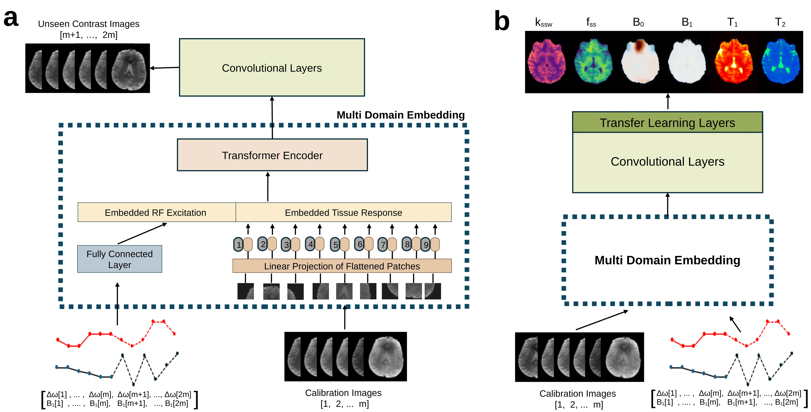

<div align="center">


<h1>Multi-Contrast Generation and Quantitative Imaging using a
Transformer-Based MRI Framework (TBMF) with RF Excitation Embeddings</h1>


<div>
    <h4 align="center">
        <a href="https://arxiv.org/abs/2305.19413" target='_blank'>
        
        </a> 
        
    </h4>

</div>
【<a href='https://github.com/DinorNagar' target='_blank'>Dinor Nagar</a> |
<a href='https://github.com/operlman' target='_blank'>Or Perlman</a>】
<div>
<a href='https://mri-ai.github.io/' target='_blank'>Momentum Lab, Tel Aviv University</a>
</div>
</div>

## 🎬 Showcases

<div align="center">
    <h3>Biophysical-model-free multi-contrast prediction</h3>
    
</div>


## 📚 Overview

We developed a biophysical-model-free deep learning framework for providing rich biological information in-vivo based on a 28.2 second-long calibration scan. <br>
 <br><br>
Two modules are available:
1. **Core Module** - a vision transformer based module that harness RF excitation embeddings to generate on demand contrasts.

2. **Quantification Module** - An extension trained to further generate quantitative parameter maps (semisolid MT, T1, T2, B0, and B1 maps).


## ⚙️ Setup 
1. Clone the repository
```bash
git clone https://github.com/momentum-laboratory/tbmf.git
```
2. Install the requirements - the code was tested on Ubuntu 22.04, installation time should take less than a minute on a desktop computer.

* pip enviroment:
```bash
pip install -r requirements.txt
```
OR:

* conda enviroment:
```bash
conda env create -f enviroment.yaml
```

3. Install yaml:
```bash
pip install pyyaml
```
## 🪄 Contrast generation / parameter quantification examples [expected run time is less than 1 min for a desktop computer]
<div align="center">
  
</div>
<br><br>

An example for each module:

* **Core Module**
```bash
python src/core_module_prediction.py
```

The results will be saved on the path `predictions\*` creating two files:
1. `core_module_predictions.mat` - contains the "on-demand contrast" generated images.
<br><br>

2. `core_module_results_fig.jpg` - compares the TBMF-based output with ground truth.
    Expected output: similar to Fig. 2a in the manuscript (see reference below), yet on a different slice.
<br><br>
* **Quantification Module**
```bash
python src/quantification_module_prediction.py
```
The results will be saved on the path `predictions\*` creating two files:
1. `quantification_module_predictions.mat`  - contains the TBMF-generated quantitative parameter maps.
<br><br>
2. `quantification_module_results_fig.jpg` - compares the TBMF-based quantitative output with ground truth.
    Expected output: similar to Fig. 3a,b in the manuscript (see reference below).

## 🔗 References
Nagar, D., Ifrah, S., Finkelstein, A., Vladimirov, N., Zaiss, M., Perlman O. Multi-Contrast Generation and Quantitative MRI using a Transformer-Based Framework with RF Excitation Embeddings. Communications Biology, In press.
